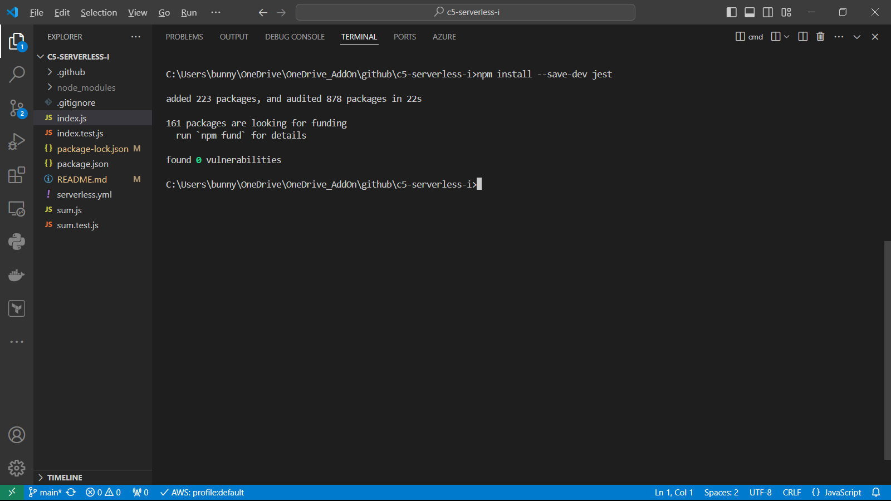
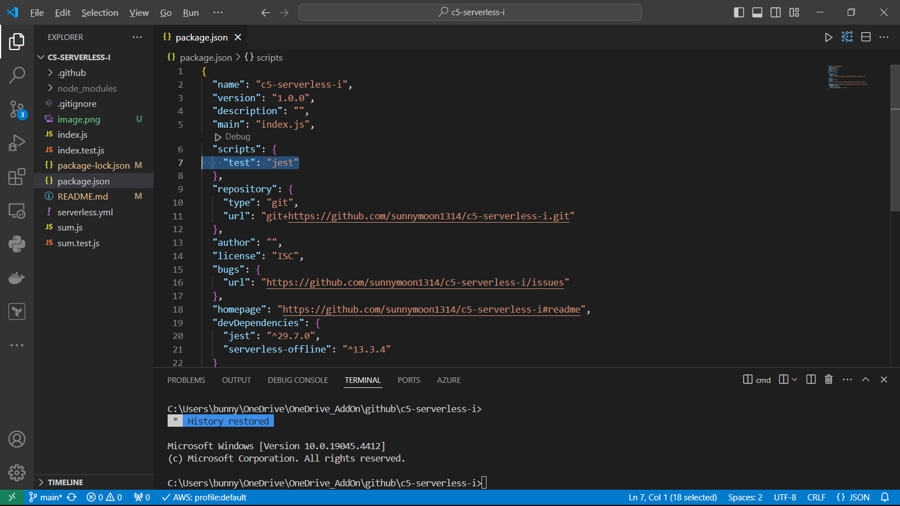
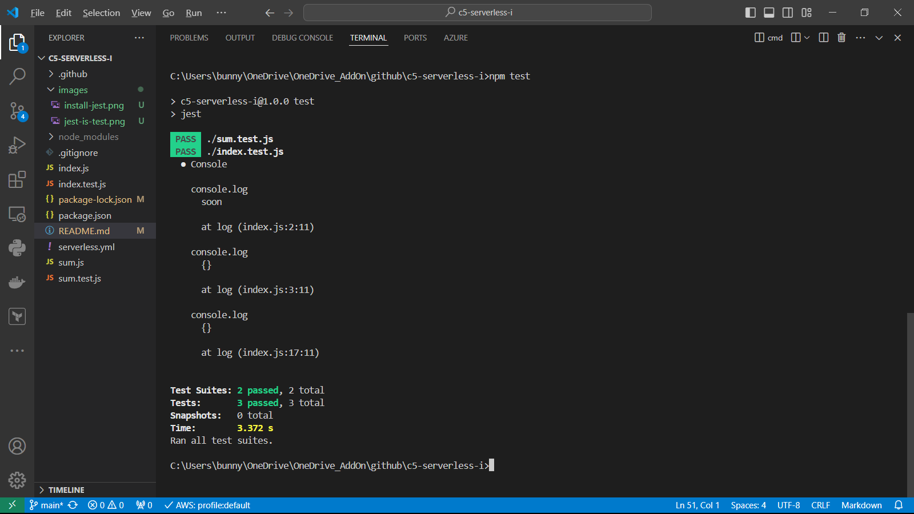

# Unit Testing of Node.js application using Jest Framework

This repository contains the code samples in Node.js that illustrate how we can adopt a Test-Driven-Development approach when implementing our Node.js application.

# What is Test-Driven-Development?

In layman’s terms, Test-Driven-Development (TDD) is a software development practice that focuses on creating unit test cases before developing the actual code. It is an iterative approach combining programming, unit test creation, and refactoring. https://www.browserstack.com/guide/what-is-test-driven-development

In other words, we will include test cases for the functions/modules that we write during development stage instead of the traditional approach of putting testing as the end phase of development.

For illustration, we will use the Jest Unit Testing Framework.

# What is Jest Framework?

Jest is an open-source Javascript testing framework developed by Facebook. It was mainly built for performing unit testing on React, Node, Babel, TypeScript, Angular, Vue, and JavaScript-based applications. 

# Types of Jest Matchers

Jest assertions use matches to assert on a condition in different ways. Jest uses matchers from the expect API. For the full list, see the Expect API doc at https://jestjs.io/docs/expect.

Some of the commonly used matchers along with Jest tests are:
- Equality
- Truthiness Assertion
- Numeric Comparison Matchers
- String Matchers

In this repository, we only show Equality test.

# Install Jest

Before we proceed, please install Jest using your favorite package manager, such as npm.

``` bash
npm install --save-dev jest
```



Open the package.json file and ensure the line (as shown in line 7) is mapping "test" to "jest".



This repository contains 2 simple Node.js scripts (index.js and sum.js) and each script has its own "test script" (index.test.js and sum.test.js respectively).

To run the test scripts, enter the below command:

``` bash
npm test
```




